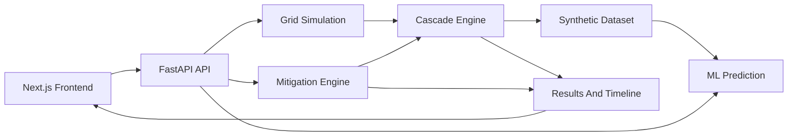

# Tripwire Architecture

Tripwire is organized as a two-service local development system.

## Frontend

The frontend is a Next.js application written in TypeScript. It is responsible for:

- Rendering the power-grid interface with React Flow.
- Managing user interactions such as selecting nodes or transmission lines.
- Sending single-component failure requests to the backend.
- Sending deterministic cascade simulation requests to the backend.
- Returning the display to the healthy baseline.
- Displaying solved operating metrics returned by the backend.
- Displaying cascade timeline playback from the stored backend response.
- Displaying current-step cascade metrics and final summary metrics.
- Displaying baseline ML risk predictions for the selected component.
- Displaying simulation-validated mitigation recommendations for selected components.
- Displaying prediction accuracy context and simulated mitigation comparisons.
- Calling the FastAPI backend through a configurable API base URL.

Core frontend packages:

- React Flow for network visualization.
- Recharts for metrics and scenario charts.
- Tailwind CSS for styling.

## Backend

The backend is a FastAPI application. It is responsible for:

- Serving API health/status endpoints.
- Building a small pandapower transmission network.
- Running a normal power-flow calculation.
- Returning the healthy solved baseline grid state.
- Applying single-component outages from a fresh baseline.
- Running deterministic cascading-failure simulations from an initial outage.
- Returning the healthy baseline through reset endpoints.
- Returning step-by-step cascade state and severity metrics.
- Generating offline CSV scenario datasets for baseline ML training and evaluation.
- Training and serving baseline ML predictions from synthetic Tripwire scenarios.
- Generating and ranking mitigation candidates through repeated deterministic cascade simulation.

Core backend packages:

- pandapower for electrical grid modeling.
- NetworkX for graph operations.
- NumPy and pandas for computation.
- scikit-learn for training and serving the current baseline classifier and regressor.

## Simulation Layer

Grid logic lives under `backend/app/simulation/` instead of inside API route handlers.

- `grid.py` creates the sample grid, runs pandapower, applies component outages, detects supplied buses, assigns component status, and serializes API-safe JSON.
- `config.py` defines the authoritative immutable `ScenarioConfig`, deterministic scenario fingerprint, operating-condition validation, and shared scenario-network builder.
- `cascade.py` runs deterministic cascading-failure simulations from one initial component failure.
- `demo.py` defines deterministic simulator-backed presentation presets.
- `scenario.py` builds stateless single-failure scenarios from a fresh baseline and wraps solved or blackout results with scenario metadata.
- `app/ml/dataset.py` generates machine-learning-ready scenario rows from configurable pre-failure operating profiles and post-cascade targets.
- `app/ml/features.py` defines the authoritative pre-failure model feature list and feature-frame builders.
- `app/ml/train.py` trains and evaluates baseline scikit-learn classifier/regressor pipelines.
- `app/ml/inference.py` loads saved pipelines and produces bounded prediction responses.
- `app/ml/schemas.py` centralizes ML targets, model version, and cascade-risk thresholds.
- `simulation/mitigation.py` generates bounded mitigation candidates, simulates each one, and ranks them against the no-mitigation baseline.
- `scripts/analyze_dataset.py` reports data-quality diagnostics for a generated CSV without training a model.
- `scripts/train_models.py` trains and saves model artifacts from a generated CSV.

The current grid is a single-voltage 230 kV teaching network. This avoids invalid direct line connections across voltage levels while keeping the topology easy to inspect.

Current baseline:

- 8 buses.
- 3 generators, including one slack source.
- 4 loads.
- 12 transmission lines.
- 400 MW total demand.
- All baseline components healthy.
- Baseline maximum line loading below 80%.

Status rules:

- Healthy: loading below 80%.
- Stressed: loading from 80% to 100%, or bus voltage outside the normal range.
- Overloaded: loading above 100%.
- Failed: out of service, disconnected, unsupplied, or missing a valid solved value.

## Cascade Engine

The cascade engine is deterministic, bounded, and stateless per request. It does not use randomness, machine learning, or mitigation recommendations.

Current flow:

1. Start from the healthy baseline grid.
2. Apply the requested initial component failure.
3. Run pandapower.
4. Record the solved grid state.
5. Find in-service transmission lines above the cascade trip threshold.
6. Trip those overloaded lines.
7. Re-run pandapower.
8. Repeat until the cascade terminates.

Current centralized cascade settings:

```text
CASCADE_TRIP_THRESHOLD_PERCENT = 100.0
DEFAULT_MAX_CASCADE_STEPS = 20
```

Termination reasons:

```text
stable
max_steps_reached
power_flow_failed
total_blackout
no_additional_failures
```

Every returned cascade step contains:

```text
step
event
newly_failed_components
overloaded_lines
grid
metrics
```

The frontend stores the complete cascade response and changes displayed React Flow data by selecting a saved step. Timeline navigation and playback do not request a new backend simulation.

Current playback behavior:

- Timeline item click jumps to that saved grid state.
- Previous and Next move one step at a time.
- Play/Pause advances through saved steps at 0.5x, 1x, or 2x speed.
- Playback stops automatically on the final step.
- Return to Baseline clears frontend cascade state and reloads the healthy grid.
- Newly failed components and currently overloaded lines are visually emphasized for the active step.

## API Boundary

The frontend reads `NEXT_PUBLIC_API_URL` and uses it for API requests. During local development, this should point to:

```text
http://127.0.0.1:8000
```

Current endpoints:

```text
GET /health
GET /ready
GET /api/grid
GET /api/grid/definition
POST /api/grid/validate
POST /api/grid/solve
GET /api/demo-presets
POST /api/failure
POST /api/cascade
POST /api/reset
GET /api/reset
POST /api/predict
POST /api/recommend
```

`GET /ready` checks that the simulator can initialize and saved ML artifacts can load. It is intended for runtime readiness checks, not deep simulation benchmarking.

Endpoint lifecycle rules:

```text
GET /api/grid      -> healthy solved baseline
POST /api/failure  -> fresh baseline + one requested outage
POST /api/cascade  -> fresh configured profile + one initial outage + automatic secondary trips
POST /api/reset    -> healthy solved baseline
GET /api/reset     -> healthy solved baseline
POST /api/predict  -> pre-failure features + saved ML pipelines
POST /api/recommend -> baseline simulation + bounded intervention simulations
```

No endpoint inherits outages from a previous request. This keeps repeated tests deterministic and avoids hidden process-level scenario state.

## Grid Definition And Editor State

`backend/app/simulation/definition.py` defines schema version 1 for buses, generators, loads, lines, electrical line parameters, and metadata. The built-in teaching grid is represented by the same schema used for imported and user-created grids. `build_network_from_definition()` is the only topology-to-pandapower construction path.

Validation checks global ID uniqueness, bus references, voltage compatibility, line parameters, generator limits, finite values, source/slack configuration, and load values. Disconnected topology is allowed when structurally valid: unsupplied islands and isolated buses are warnings, not schema errors.

The frontend keeps three independent state domains:

```text
GridDefinition       electrical topology and ratings
OperatingCondition   multipliers, dispatch, and initial failure
VisualLayout         positions, lock state, and display options
```

`grid-editor-state.ts` owns immutable CRUD helpers, bounded undo/redo, schema-versioned scenario documents, local preset storage, draft autosave, and import parsing. Electrical edits clear stale prediction/cascade/mitigation results. Visual movement never changes the submitted electrical definition.

Custom API requests remain stateless by carrying `grid_definition` in the request body. Deterministic failure, cascade, and mitigation use the submitted components. ML compatibility requires an exact match with the built-in definition; modified topology is rejected rather than scored by an incompatible model.

Prediction, single failure, cascade, and recommendation requests are normalized into the same `ScenarioConfig`. The configuration contains the operating multipliers, dispatch profile, initial component failure, optional preset identifier, and seed. Every scenario network is created by `build_scenario_network(config)`, and responses expose a deterministic `scenario_id` that excludes the mitigation action. Baseline and mitigation candidates therefore differ only by the intervention.

The frontend keeps the original unmitigated cascade and the replayed mitigated cascade in separate state. Inspecting a component is local UI state and does not reload the grid or invalidate results. Starting an action against a newly inspected component, changing a preset, or changing an operating profile invalidates only dependent results. Reset clears all scenario state and returns the profile and grid to baseline.

`frontend/components/grid/scenario-state.ts` owns these transitions in a single reducer. A revision number rejects late responses after a configuration change or reset, and scenario fingerprints prevent mismatched comparison results. Grid previews use operating-condition query parameters on `GET /api/grid`. `pnpm test` covers replay immutability, profile/component invalidation, reset, and late responses.

## Architecture Diagram



## Demo Presets

`GET /api/demo-presets` returns deterministic presentation scenarios:

```text
low-risk           line-402, baseline profile, depth 0, 0% load lost
severe-cascade     line-101, critical profile, depth 2, 100% load lost
mitigation-example line-101, critical profile, depth 2, 100% load lost before mitigation
```

The frontend uses these presets to select the component and operating condition. Outcomes still come from `/api/predict`, `/api/cascade`, and `/api/recommend`.

`GET /api/grid` returns:

```text
nodes
lines
metrics
```

The metrics distinguish demand from served load:

```text
total_demand_mw
served_load_mw
unserved_load_mw
total_generation_mw
max_line_loading_percent
load_lost_percent
failed_components
failed_lines
```

`POST /api/failure` accepts one component failure at a time:

```json
{
  "component_type": "line",
  "component_id": "line-101"
}
```

It returns:

```text
status
termination_reason
initial_failure
grid
metrics
```

Failure termination reasons:

```text
solved
no_slack_source
total_blackout
```

A source/slack bus outage is represented as a valid HTTP 200 blackout scenario. The response keeps finite numeric metrics, including zero served load, full unserved demand, and 100% load lost.

`POST /api/cascade` accepts the same component fields plus an optional `max_steps` value and optional operating condition:

```json
{
  "component_type": "line",
  "component_id": "line-101",
  "max_steps": 20,
  "operating_condition": {
    "load_multiplier": 1.5,
    "generation_multiplier": 1.0,
    "line_rating_multiplier": 0.32,
    "dispatch_profile": "balanced"
  }
}
```

The cascade endpoint returns the initial failure, termination reason, cascade depth, all preserved steps, and final metrics such as load lost percentage, failed component count, failed line count, and peak line loading. Without an operating condition, it uses the baseline profile.

`POST /api/predict` accepts an initial component and operating condition:

```json
{
  "component_type": "line",
  "component_id": "line-101",
  "operating_condition": {
    "load_multiplier": 1.5,
    "generation_multiplier": 1.0,
    "line_rating_multiplier": 0.32,
    "dispatch_profile": "balanced"
  }
}
```

The endpoint constructs the same pre-failure feature row used during training, runs the saved classifier and regressor pipelines, and returns cascade probability, predicted load lost percentage, risk level, and model version. It does not run the cascade simulation to derive the answer.

`POST /api/recommend` accepts the same component and operating-condition shape plus candidate limits:

```json
{
  "component_type": "line",
  "component_id": "line-101",
  "operating_condition": {
    "load_multiplier": 1.25,
    "generation_multiplier": 1.0,
    "line_rating_multiplier": 0.35,
    "dispatch_profile": "balanced"
  },
  "max_candidates": 6,
  "top_n": 3
}
```

It returns the no-mitigation baseline, beneficial recommendations sorted by score, simulated outcomes, improvement values, scoring weights, candidate counts, runtime, and a replayable cascade result for each recommendation.

## Dataset Pipeline

Dataset generation is an offline backend workflow. It is intentionally not exposed as a public API endpoint.

Flow:

```text
healthy grid model
-> independent operating-condition profiles
-> initial failure candidates
-> pre-failure feature extraction
-> deterministic cascade simulation
-> target/label extraction
-> CSV + metadata
```

Default output:

```text
backend/data/generated/tripwire_scenarios.csv
backend/data/generated/dataset_metadata.json
```

Feature columns are limited to values known before the initial failure:

```text
scenario metadata
load multiplier
generation availability multiplier
generator dispatch profile
line rating multiplier
pre-failure demand and generation
available generation capacity
reserve margin
pre-failure line loading statistics
network component counts
failed component pre-failure loading/capacity
endpoint load/generation context
endpoint voltage and degree
NetworkX centrality/path features
```

Operating profiles are configured per scenario and do not mutate global grid state. The current defaults intentionally include stressed dataset-only cases:

```text
load_multipliers = 1.0, 1.15, 1.25, 1.35, 1.5
generation_multipliers = 0.8, 0.9, 1.0, 1.1
line_rating_multipliers = 0.6, 0.5, 0.45, 0.4, 0.38, 0.35, 0.32
dispatch_profiles = balanced, south_heavy, harbor_heavy, south_reduced
```

The application baseline returned by `GET /api/grid` remains healthy. Dataset line-rating stress is applied only inside generated scenario networks so positive cascade labels arise from actual simulated overloads and secondary trips.

Reserve margin is a pre-failure feature:

```text
reserve_margin_mw = available_generation_capacity_mw - total_demand_mw
reserve_margin_percent = reserve_margin_mw / total_demand_mw * 100
```

It is not calculated from solved post-failure generation.

Target columns are post-cascade labels and outcomes:

```text
cascade_happened
cascade_depth
total_failed_lines
total_failed_components
overloaded_events
served_load_mw
unserved_load_mw
load_lost_percent
peak_line_loading_percent
termination_reason
severity_label
```

The `cascade_happened` target is true only when at least one secondary failure occurs after the initial failure. It is false for scenarios where only the initial component fails.

Severity labels are deterministic:

```text
LOW: 0 <= load lost < 5%
MODERATE: 5 <= load lost < 20%
HIGH: 20 <= load lost < 50%
CRITICAL: load lost >= 50%
```

The generator validates that scenario IDs are unique, required fields are present, numeric values are finite, impossible negative values are absent, load lost is between 0 and 100%, cascade depth is non-negative, served plus unserved load balances to demand, and severity labels are known.

Dataset metadata includes schema version, git commit when available, grid version, cascade threshold, configured multipliers, dispatch profiles, seed, scenario count, positive rate, feature columns, target columns, failed/excluded scenario count, and generation timestamp.

Diagnostics can be run with:

```powershell
.\.venv\Scripts\python.exe scripts\analyze_dataset.py
```

The diagnostics script prints dataset size, positive cascade rate, severity distribution, feature ranges, potential constant columns, highly imbalanced categorical values, missing/non-finite value counts, and duplicate count. It intentionally does not train a model.

## Machine Learning Methodology

Current model targets:

```text
Classification: cascade_happened
Regression: load_lost_percent
```

The feature list is defined programmatically in `app/ml/features.py` and includes only pre-failure columns from the dataset. It excludes targets and post-cascade values such as cascade depth, failed component counts, final served/unserved load, termination reason, severity label, and final load lost.

Categorical features are handled with `OneHotEncoder(handle_unknown="ignore")`. Numeric features pass through a `ColumnTransformer`; scaled pipelines are used for linear models. The preprocessing is inside each scikit-learn `Pipeline`, so transformations are fit only on the training split.

The default evaluation uses separate training, validation, and final test partitions produced with `GroupShuffleSplit` grouped by initial failed component when all partitions contain both cascade classes. Candidate models are selected on validation metrics, refit on training plus validation data, and reported once against the untouched final test split. This reduces leakage from near-duplicate operating scenarios for the same failed component. If a small test dataset cannot support grouped partitions, training falls back to separate stratified train, validation, and test splits.

Current baseline model families:

```text
Classifier: Logistic Regression, Random Forest Classifier
Regressor: Ridge Regression, Random Forest Regressor
```

Champion selection is metric-based:

```text
Classifier: highest F1, then ROC AUC and recall
Regressor: lowest MAE
```

Saved artifacts:

```text
backend/models/cascade_classifier.joblib
backend/models/load_loss_regressor.joblib
backend/models/model_metadata.json
```

Cascade risk levels are probability bands:

```text
LOW: 0.00 <= p < 0.25
MODERATE: 0.25 <= p < 0.50
HIGH: 0.50 <= p < 0.75
CRITICAL: 0.75 <= p <= 1.00
```

These risk levels are separate from load-loss severity labels. Feature importance values are predictive associations within Tripwire's synthetic simulation dataset, not causal statements about real power grids.

The current models are not trained on operational grid data and should not be presented as utility-grade reliability tools.

## Mitigation Methodology

Mitigation is simulation-validated. The module does not use an LLM to invent actions and does not use ML predictions as the source of truth for ranking.

Implemented candidate types:

```text
generator_redispatch
load_shedding
```

Generator redispatch shifts 5% or 10% output between `gen-south` and `gen-harbor` and rejects actions that would exceed configured available capacity or create negative generation. Controlled load shedding sheds 2%, 5%, or 10% at individual load buses or across all load buses and rejects percentages above the configured limit.

Redispatch preserves demand. Controlled shedding does not disappear from the loss calculation: the network retains original demand and reports controlled shed, involuntary unserved load, total unserved load, served load, and load-lost percentage separately. Load-loss improvement is expressed as percentage-point reduction.

Per request flow:

1. Build the fresh operating profile.
2. Simulate the requested initial failure with no mitigation.
3. Generate at most the configured number of feasible candidates.
4. For each candidate, rebuild the fresh operating profile.
5. Apply the mitigation before the initial failure.
6. Run the full deterministic cascade.
7. Compare the simulated outcome against the no-mitigation baseline.
8. Return only beneficial recommendations.

Centralized scoring weights:

```text
LOAD_LOSS_REDUCTION_WEIGHT = 10.0
FAILED_COMPONENT_REDUCTION_WEIGHT = 2.0
CASCADE_DEPTH_REDUCTION_WEIGHT = 3.0
INTERVENTION_COST_WEIGHT = 0.25
```

The scoring function prioritizes load-loss reduction, then fewer failed components, then lower cascade depth, while applying a small penalty for intervention size. Returned recommendations should be described as "Recommended based on Tripwire simulation" and not as guaranteed blackout prevention.

## Configuration And CI

Backend runtime configuration is environment-driven:

```text
ALLOWED_ORIGINS
ALLOW_ORIGIN_REGEX
MODEL_PATH
DATA_PATH
LOG_LEVEL
```

Development defaults allow localhost frontend origins. `MODEL_PATH` and `DATA_PATH` are the preferred deployment names; `MODEL_DIR` and `DATA_DIR` remain supported for compatibility. Production should set explicit allowed frontend origins and should not use wildcard CORS with credentials.

The repository includes GitHub Actions CI for:

```text
backend: install Python dependencies and run pytest
frontend: install pnpm dependencies, run tests, run lint, run production build
```

## Final Limitations

- The electrical grid is synthetic and intentionally small.
- Operating profiles are simplified and generated for repeatable demos.
- The ML models are trained only on Tripwire synthetic simulation scenarios.
- No real utility operating data has been used for validation.
- The application is not intended for operational grid control.
- Mitigation recommendations are simulation-derived and bounded to simple redispatch/load-shedding candidates.
- The frontend is deployed on Vercel and the API is deployed on Render using the repository deployment configuration.
